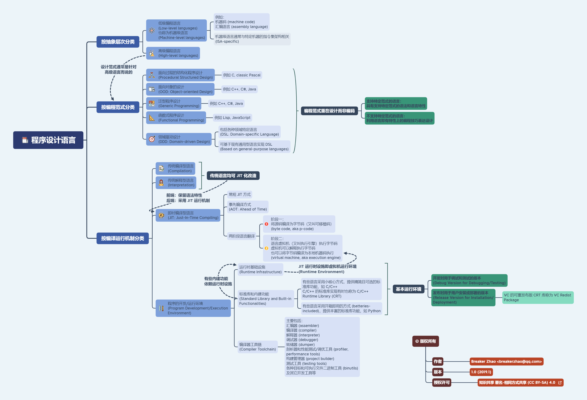

[问题] 能否用高级语言 (C++, Java, Python) 编出低级语言编译器 (Pascal, Basic) (2019.1)  
<https://www.zhihu.com/question/308117188>  
我的回答 (2019.1)  
<https://www.zhihu.com/question/308117188/answer/575194441>

## 配图

prog_lang_types.xmind

注：该思维导图用 2020 年后的新版 XMind 绘制，使用经典版 XMind 8 无法正确打开。

